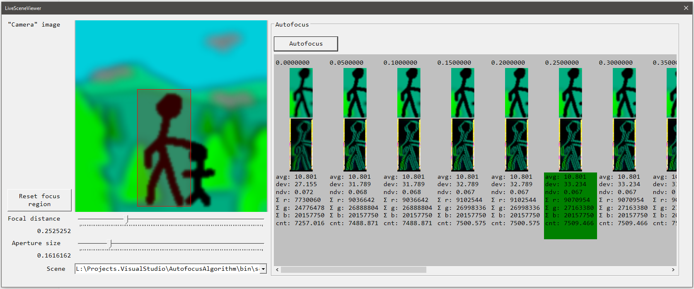

# Autofocus Algorithm

This repo contains a textbook autofocus algorithm which has been implemented using C# and .NET5.

### Screenshot(s)

The screenshot demonstrates the basic functionality of the autofocus "application":

- The user can select between multiple scenes
- The user can change the focal distance and aperture size at will
- A focus region can be defined by clicking/dragging a rectangle on the scene
- By clicking the `[Autofocus]`-button, the user can instruct the application to find the optimal focal length to keep the selected region in focus.